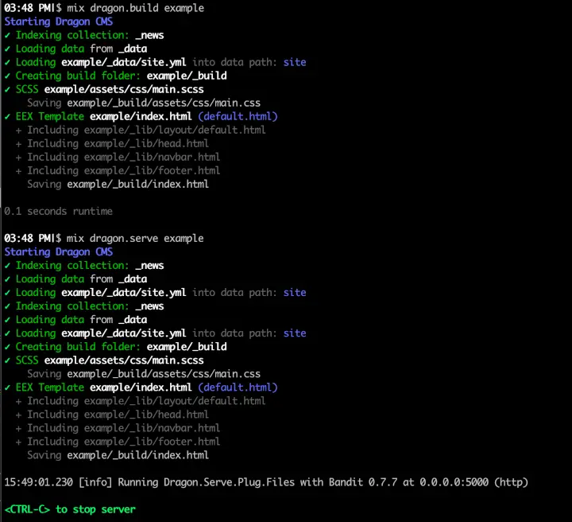

# Dragon

<b><i>Website Content Management System using Embedded Elixir templates (EEX)</i></b>

___BETA___ — fairly feature complete, but needs some sea trials. See the [TODO](docs/todo.md) for more info.

Dragon is a content management system similar to Jekyll, but using Elixir and
EEX templates, along with some improvements to behavior
(cue [xkcd comic](https://xkcd.com/927/)). It is the static-site
generator counterpoint to the Elixir Phoenix appserver.

If you are familiar with Jekyll, you should be able to migrate fairly easily.

Benefits of Dragon:

* Templates using powerful EEX rather than liquid. This comes with a feature-rich
  environment for all sorts of functionality (limited only by Elixir/EEX).
* Robust and extensible data handling system
* Very little "magic" and hard assertions. Other than the top level configuration
  file, the rest of it is up to how you configure your project.
* Relative includes! No need for files scattered all over in include folders,
  just include it from your local path. You can still use library folders if you
  so desire, in any location you choose (starting an included file with a slash
  resolves that file based on the project root, rather than relatively to the
  current file) — see [Using](docs/using.md) for more details.

For more information see: [Using](docs/using.md).

Additional topics:

* [Installation](docs/installation.md)
* [Using](docs/using.md)
* [TODO](docs/todo.md)
* [Contributors](docs/contributors.md)
* [Developer Notes](docs/developer-notes.md)

## Example:

## FAQ

#### Aren't Static CMS's dead?

Of course not! A majority of web content is static! With Dragon you can
easily build and deploy a site to a statically served CDN, such as Amazon,
and host your site for pennies if not chump change (sidebar: article on
how to do this pending, but checkout <https://github.com/srevenant/website-2-s3-cdn>).

As Dragon evolves it'll become more integrated with Phoenix, so you can
leverage the power of both a static content generator and a dynamic appserver!
